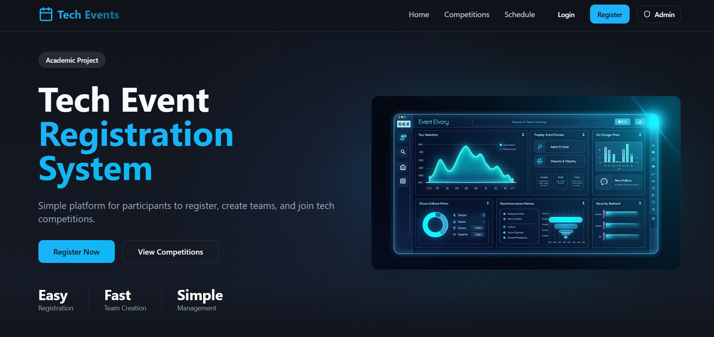
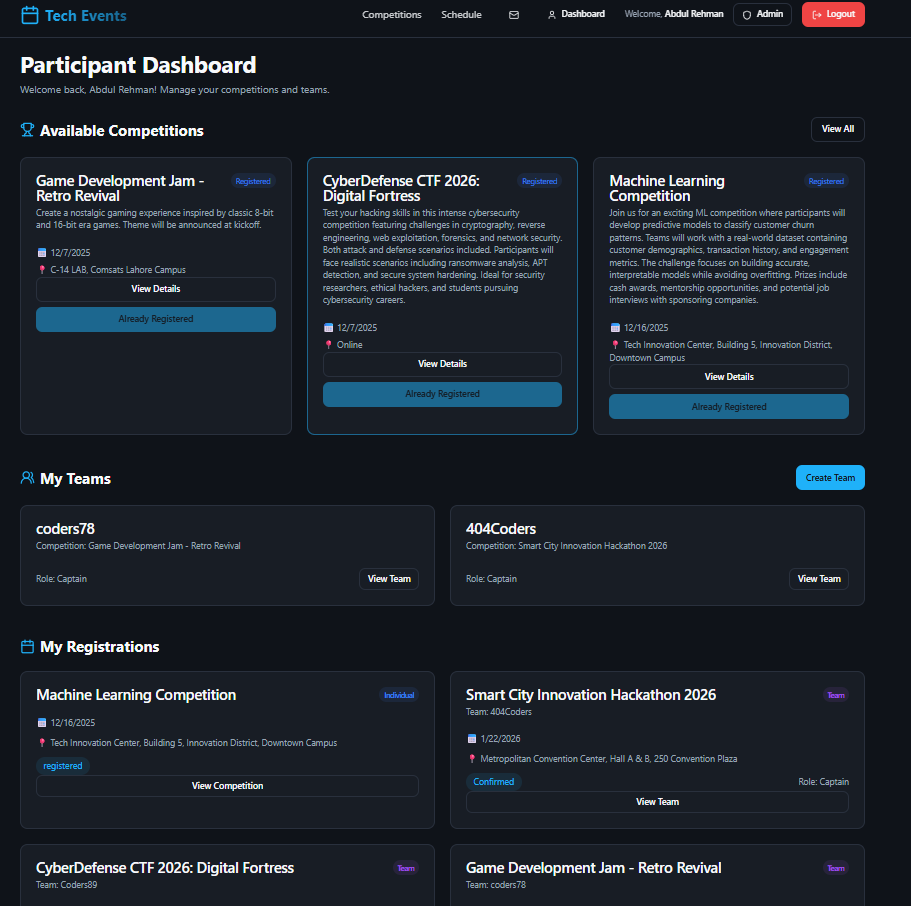
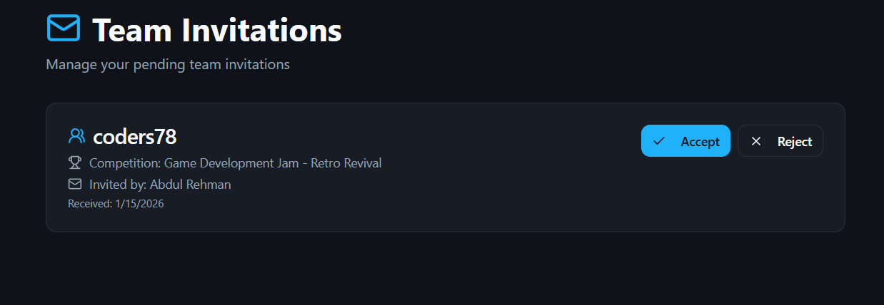
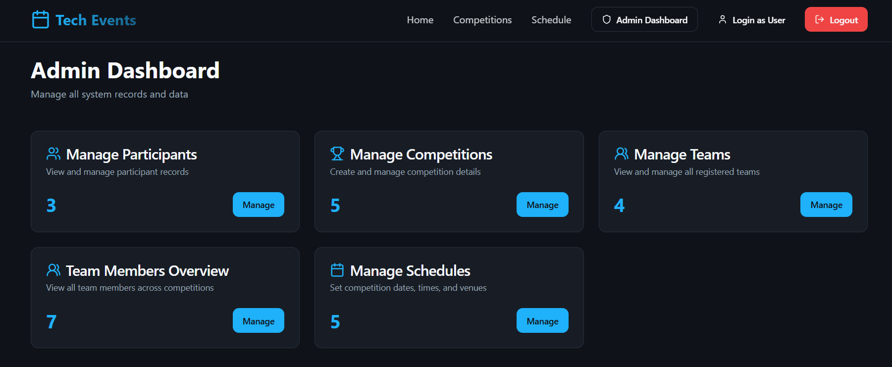

# 🎓 Tech Event Registration System

A full-stack web application for managing technical events, competitions, and team registrations. Built as a Database Management Systems (DBMS) course project to demonstrate practical implementation of relational database concepts.



## 📌 Project Overview

The Tech Event Registration System is a comprehensive platform that allows participants to register for technical competitions, create teams, manage invitations, and track their event participation. Administrators can manage competitions, participants, teams, and schedules through a dedicated dashboard.

## ✨ Features

### Participant Features
- 🔐 **User Authentication** - Secure registration and login system
- 🏆 **Competition Discovery** - Browse available technical competitions
- 👥 **Team Management** - Create teams and manage team members
- ✉️ **Invitation System** - Send and receive team invitations
- 📊 **Personal Dashboard** - View registered competitions and team status
- 📅 **Event Schedule** - Check competition dates and venues

### Admin Features
- 👨‍💼 **Admin Dashboard** - Centralized management interface
- 🎯 **Manage Competitions** - Create, update, and delete competitions
- 👤 **Manage Participants** - View and manage participant records
- 🤝 **Manage Teams** - Oversee all registered teams
- 📅 **Schedule Management** - Set competition dates, times, and venues
- 📈 **Analytics** - View statistics on participants, teams, and competitions

## 🛠 Technology Stack

### Frontend
- **React 18** - UI library
- **TypeScript** - Type-safe JavaScript
- **Vite** - Build tool and dev server
- **Tailwind CSS** - Utility-first CSS framework
- **shadcn/ui** - Re-usable component library built on Radix UI
- **React Router DOM** - Client-side routing
- **React Hook Form** - Form validation
- **TanStack Query** - Server state management
- **Axios** - HTTP client
- **Zod** - Schema validation
- **Lucide React** - Icon library

### Backend
- **Node.js** - Runtime environment
- **Express.js** - Web framework
- **MySQL2** - MySQL database driver
- **JWT** - JSON Web Tokens for authentication
- **bcryptjs** - Password hashing
- **CORS** - Cross-Origin Resource Sharing
- **Express Validator** - Request validation middleware
- **dotenv** - Environment variable management

### Database
- **MySQL** - Relational database management system

## 📂 Project Structure
```
Tech_Event_Management_System/
│
├── backend/
│   ├── config/
│   │   └── db.js              # Database connection
│   ├── controllers/
│   │   ├── authController.js
│   │   ├── competitionController.js
│   │   ├── teamController.js
│   │   └── invitationController.js
│   ├── middleware/
│   │   ├── auth.js            # JWT authentication
│   │   └── validation.js      # Request validation
│   ├── routes/
│   │   ├── auth.js
│   │   ├── competitions.js
│   │   ├── teams.js
│   │   └── invitations.js
│   ├── seeds/
│   │   └── createAdmin.js     # Admin seeder
│   ├── .env.example
│   ├── package.json
│   └── server.js              # Entry point
│
├── frontend/
│   ├── public/                # Static assets
│   ├── src/
│   │   ├── components/
│   │   │   ├── ui/           # shadcn/ui components
│   │   │   ├── Navbar.tsx
│   │   │   └── ...
│   │   ├── pages/
│   │   │   ├── Home.tsx
│   │   │   ├── Login.tsx
│   │   │   ├── Register.tsx
│   │   │   ├── Dashboard.tsx
│   │   │   ├── Competitions.tsx
│   │   │   ├── Schedule.tsx
│   │   │   ├── Invitations.tsx
│   │   │   └── Admin.tsx
│   │   ├── services/
│   │   │   └── api.ts        # API service layer
│   │   ├── App.tsx
│   │   └── main.tsx
│   ├── .env.example
│   ├── package.json
│   ├── tsconfig.json
│   ├── vite.config.ts
│   └── tailwind.config.js
│
├── database/
│   ├── schema.sql            # Database schema
│   └── sample_data.sql       # Sample data (optional)
│
└── README.md
```

## 🗄 Database Design

### Key Tables
- **participants** - User account information
- **competitions** - Competition details and metadata
- **teams** - Team information
- **team_members** - Team membership records
- **registrations** - Competition registrations
- **invitations** - Team invitation system
- **schedules** - Competition scheduling information

### Database Concepts Demonstrated
- ✅ Relational schema design
- ✅ Primary and Foreign Keys
- ✅ Data normalization (3NF)
- ✅ SQL Joins (INNER, LEFT)
- ✅ Constraints (UNIQUE, NOT NULL, CHECK)
- ✅ Indexes for query optimization
- ✅ Complex SQL queries
- ✅ Transaction handling

## 🚀 Installation & Setup

### Prerequisites
- Node.js (v18 or higher)
- MySQL (v8.0 or higher)
- npm or yarn

### 1. Clone the Repository
```bash
git clone https://github.com/iamabd55/Tech_Event_Management_System.git
cd Tech_Event_Management_System
```

### 2. Database Setup
```bash
# Login to MySQL
mysql -u root -p

# Create database
CREATE DATABASE event_management;

# Use the database
USE event_management;

# Import schema
source database/schema.sql;
```

### 3. Backend Setup
```bash
cd backend
npm install

# Create .env file
cp .env.example .env
```

**Configure `.env` file:**
```env
PORT=5000
DB_HOST=localhost
DB_USER=root
DB_PASSWORD=your_mysql_password
DB_NAME=event_management
JWT_SECRET=your_secret_key_here
JWT_EXPIRE=7d
```

**Seed Admin User (Optional):**
```bash
npm run seed:admin
```

**Start Backend:**
```bash
npm run dev
# Server runs on http://localhost:5000
```

### 4. Frontend Setup
```bash
cd frontend
npm install

# Create .env file
cp .env.example .env
```

**Configure `.env` file:**
```env
VITE_API_URL=http://localhost:5000/api
```

**Start Frontend:**
```bash
npm run dev
# App runs on http://localhost:8080
```

## 📸 Screenshots

### Landing Page


### Participant Dashboard


### Team Invitations


### Admin Dashboard


## 🔗 API Endpoints

### Authentication
- `POST /api/auth/register` - Register new participant
- `POST /api/auth/login` - User login
- `GET /api/auth/profile` - Get user profile

### Competitions
- `GET /api/competitions` - Get all competitions
- `GET /api/competitions/:id` - Get competition details
- `POST /api/competitions` - Create competition (Admin)
- `PUT /api/competitions/:id` - Update competition (Admin)
- `DELETE /api/competitions/:id` - Delete competition (Admin)

### Teams
- `POST /api/teams` - Create team
- `GET /api/teams/:id` - Get team details
- `GET /api/teams/my-teams` - Get user's teams

### Invitations
- `POST /api/invitations` - Send team invitation
- `GET /api/invitations` - Get user invitations
- `PUT /api/invitations/:id/accept` - Accept invitation
- `PUT /api/invitations/:id/reject` - Reject invitation

## 🎓 Course Information

- **Course:** Database Management Systems (DBMS)
- **Project Type:** Academic Project
- **Objective:** Demonstrate practical application of database concepts

## 👤 Developer

**Abdul Rehman**  
- GitHub: [@iamabd55](https://github.com/iamabd55)
- Project: [Tech Event Management System](https://github.com/iamabd55/Tech_Event_Management_System)

## 📝 License

This project is created for educational purposes as part of a DBMS course.

## 🙏 Acknowledgments

- shadcn/ui for the beautiful component library
- Radix UI for accessible component primitives
- MySQL documentation and community

---

**⭐ If you found this project helpful, please give it a star!**
